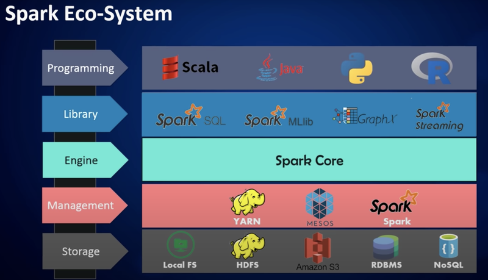
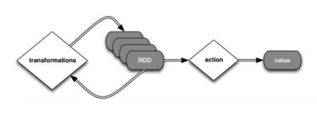

# BigData
bigdata framework인 **spark** 에 대한 기초 코드 및 실습 내용을 담았습니다.
python에서 pyspark API를 활용하여 spark 를 사용 가능합니다.

## Spark란?
- In-memory 기반의 클러스터 컴퓨팅 데이터 처리 프로그램
- RDD(Resilient Distributed Dataset)을 구현하기 위한 프로그램
- in memory 기반의 데이터 처리방식이 real-time분석을 가능하게 해 줌으로서 하드디스크가 아닌 메모리에서 관리하고 실시간으로 분석할 수 있게 함
- Spark SQL, Spark Streaming, MLlib 와 같은 라이브러리가 있음
  - Spark SQL: SQL 관련 작업
  - Streaming: Streaming 데이터 처리
  - MLlib: Machine Learning 관련 라이브러리
  - GraphX: Graph Processing

### Lazy execution으로 '빅' 데이터를 처리한다!
- 효율적인 처리/분석 가능
- Transform/Action으로 구분하여 Action일 경우에만 실제 실행이 발생 : 속도 향상
- Transfromation: `filter`, `select`, `drop`, `join`, `dropDuplicates`, `distinct`, `withColumn`, `pivot`, `get_json_object`, `sample`
Action: `count`, `collect`, `show,head`, `take`

### Basic
- [pyspark_basic_1](https://github.com/crosstar1228/bigdata/blob/main/pyspark_basic_1.ipynb)
  `SparContext`,`RDD`의 개념과 함께 `Transformation`에 해당하는 함수(`map`, `filter`, `flatmap`)를 담았습니다.
- [pyspark_basic_2](https://github.com/crosstar1228/bigdata/blob/main/Basic/pyspark_basic_2.ipynb)
  Action(`collect()`, `take`, `count` , `reduce`, `saveAsTextFile`)에 관한 함수를 담았습니다.
- [pyspark_basic_3(SQL)](https://github.com/crosstar1228/bigdata/blob/main/Basic/pyspark_basic_3_SQL.ipynb)
  pyspark의 `SQLContext` 생성을 통해 `select`, `join`, `groupby-agg-alias`, `describe`, `show` 등의 기본 명령어를 다뤄 봅니다.

### Hands-on
- [pyspark_handson_1](https://github.com/crosstar1228/bigdata/blob/main/hands-on/pyspark_handson_1.ipynb)
  DataFrame 형태로 csv 파일을 불러오고 전처리를 해봅니다.
- [pyspark_handson_2](https://github.com/crosstar1228/bigdata/blob/main/hands-on/pyspark_handson_2.ipynb)
  pyspark `filter`, `map`, `reducebykey` 를 이용하여 wordcounter를 구현하고, titanic dataset에서 사망자와 생존자의 평균 나이를 구해봅니다.
- [pyspark_handson_3(MLlib)](https://github.com/crosstar1228/bigdata/blob/main/hands-on/pyspark_handson_3(MLlib).ipynb)
  MLlib를 활용하여 binary classification을 진행하여 봅시다. 전처리부터 모델 학습 및 평가, hyperparameter tuning까지의 일련의 과정입니다.
